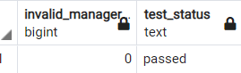
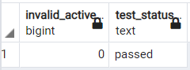
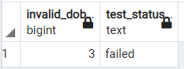
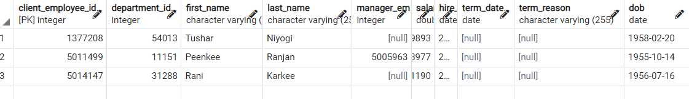

#Employee queries

---
###1. Check if any manager is not assigned to an employee
~~~sql
SELECT
    COUNT(*) AS invalid_manager,
    CASE
        WHEN COUNT(*) > 0 THEN 'failed'
        ELSE 'passed'
    END AS test_status
FROM employee t
WHERE role='Manager' AND client_employee_id NOT IN(
	SELECT DISTINCT manager_employee_id FROM employee
)
~~~

###2. Check if there are employees who are inactive but do not have a term date

~~~sql
SELECT
    COUNT(*) AS invalid_active,
    CASE
        WHEN COUNT(*) > 0 THEN 'failed'
        ELSE 'passed'
    END AS test_status
FROM employee
WHERE is_active = false AND term_date IS NULL;
~~~

###3. Check if all the active employees are aged between 18 and 60 (working age).

~~~sql
SELECT
    COUNT(*) AS invalid_dob,
    CASE
        WHEN COUNT(*) > 0 THEN 'failed'
        ELSE 'passed'
    END AS test_status
FROM employee
WHERE  EXTRACT(YEAR FROM AGE(CURRENT_DATE,dob))>60  OR EXTRACT(YEAR FROM AGE(CURRENT_DATE,dob))<18;
~~~

###4.  Check if part time employees have salaries greater than 10,000

~~~sql
SELECT
    COUNT(*) AS invalid_dob,
    CASE
        WHEN COUNT(*) > 0 THEN 'failed'
        ELSE 'passed'
    END AS test_status
FROM employee
WHERE  EXTRACT(YEAR FROM AGE(CURRENT_DATE,dob))>60  OR EXTRACT(YEAR FROM AGE(CURRENT_DATE,dob))<18;
~~~

