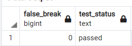

##Write test scripts for the following test cases

---
* Check if a single employee is listed twice with multiple ids.
~~~sql
SELECT
  COUNT(client_employee_id) AS duplicate_employees,
  CASE
      WHEN COUNT(client_employee_id) > 0 THEN 'failed'
      ELSE 'passed'
  END AS test_status
FROM employee
WHERE client_employee_id IN (SELECT client_employee_id FROM employee GROUP BY client_employee_id HAVING COUNT(client_employee_id)>1);
~~~

---
* Check if part time employees are assigned other fte_status.
~~~sql
SELECT
    COUNT(*) AS false_status,
    CASE
        WHEN COUNT(*) > 0 THEN 'failed'
        ELSE 'passed'
    END AS test_status
FROM employee
WHERE fte_status='Full Time' AND fte<1;
~~~

---
* Check if termed employees are marked as active.

~~~sql
SELECT
    COUNT(*) AS false_active,
    CASE
        WHEN COUNT(*) > 0 THEN 'failed'
        ELSE 'passed'
    END AS test_status
FROM employee
WHERE term_date <> NULL AND is_active=true;
~~~

---
* Check if the same product is listed more than once in a single bill.
~~~sql
SELECT
    COUNT(*) AS repeated_product,
    CASE
        WHEN COUNT(*) > 1 THEN 'failed'
        ELSE 'passed'
    END AS test_status
FROM sales
WHERE bill_no IN
(SELECT bill_no FROM sales GROUP BY product_id,sales.bill_no HAVING COUNT(product_id)>1);
~~~

---

* Check if the customer_id in the sales table does not exist in the customer table.
~~~sql
SELECT
    COUNT(*) AS exist_customer,
    CASE
        WHEN COUNT(*) > 1 THEN 'failed'
        ELSE 'passed'
    END AS test_status
FROM sales
WHERE customer_id NOT IN(SELECT customer_id FROM customer);
~~~

___
* Check if there are any records where updated_by is not empty but updated_date is empty.
~~~sql
SELECT
    COUNT(*) AS false_update,
    CASE
        WHEN COUNT(*) > 1 THEN 'failed'
        ELSE 'passed'
    END AS test_status
FROM sales
WHERE updated_by <> NULL AND updated_date is NULL;
~~~

---
* Check if there are any hours worked that are greater than 24 hours.
  
~~~sql
SELECT
    COUNT(*) AS over_time,
    CASE
        WHEN COUNT(*) > 1 THEN 'failed'
        ELSE 'passed'
    END AS test_status
FROM timesheet
WHERE hours_worked>24
~~~

---
* Check if non on-call employees are set as on-call.
  
~~~sql
SELECT
	COUNT(*) AS false_on_call,
	CASE 
		WHEN COUNT(*) > 0 THEN 'failed' 
		ELSE 'passed' 
	END AS test_status
FROM
(
SELECT employee_id, shift_date FROM timesheet t  WHERE t.was_on_call IS True
EXCEPT
SELECT CAST(employee_id as INT), CAST(punch_apply_date AS DATE)
FROM timesheet_raw tr WHERE tr.paycode = 'ON_CALL' 
GROUP BY tr.employee_id, tr.punch_apply_date ) record;
~~~

---
* Check if the break is true for employees who have not taken a break at all.
~~~sql
SELECT
	COUNT(*) AS false_on_call,
	CASE 
		WHEN COUNT(*) > 0 THEN 'failed' 
		ELSE 'passed' 
	END AS test_status
FROM
(
SELECT employee_id, shift_date FROM timesheet t  WHERE t.was_on_call IS True
EXCEPT
SELECT CAST(employee_id as INT), CAST(punch_apply_date AS DATE)
FROM timesheet_raw tr WHERE tr.paycode = 'ON_CALL' 
GROUP BY tr.employee_id, tr.punch_apply_date ) record;
~~~

---
* Check if the night shift is not assigned to the employees working on the night shift.
~~~sql
	SELECT COUNT(*) AS night_shift_check,
		CASE
			WHEN COUNT(*) > 1 THEN 'failed'
			ELSE 'passed'
		END AS test_status
	FROM timesheet
	WHERE  shift_start_time > CAST('19:00:00' AS time) AND shift_type <>'Night'
~~~

