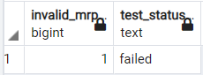
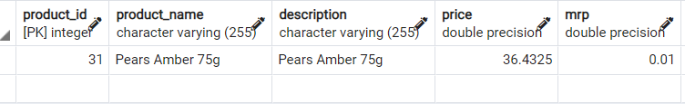
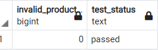
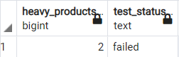
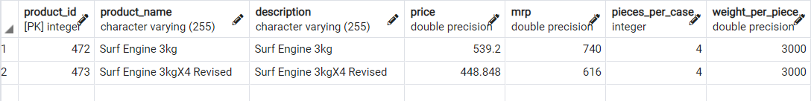
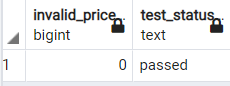

#Product queries

---
###1.  Check if any mrp of a product is lesser than its price.

~~~sql
SELECT
    COUNT(*) AS invalid_mrp,
    CASE
        WHEN COUNT(*) > 0 THEN 'failed'
        ELSE 'passed'
    END AS test_status
FROM product
WHERE mrp<price;
~~~

###2. Check if a product from one brand is registered under another brand
~~~sql
SELECT
    COUNT(*) AS invalid_mrp,
    CASE
        WHEN COUNT(*) > 0 THEN 'failed'
        ELSE 'passed'
    END AS test_status
FROM product p
WHERE p.product_name IN (SELECT product_name FROM product WHERE p.brand <> brand);
~~~

###3. Check if there are any heavy products (more than 1000)

~~~sql
SELECT
    COUNT(*) AS heavy_products,
    CASE
        WHEN COUNT(*) > 0 THEN 'failed'
        ELSE 'passed'
    END AS test_status
FROM product 
WHERE weight_per_piece >1000;
~~~

###4. Check if price of a product is invalid

~~~sql
SELECT
    COUNT(*) AS invalid_price,
    CASE
        WHEN COUNT(*) > 0 THEN 'failed'
        ELSE 'passed'
    END AS test_status
FROM product 
WHERE price <0;
~~~
