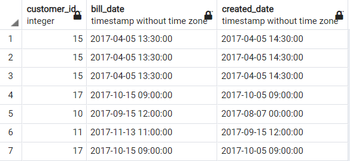

#Sales queries

---
###1.  Check if any inactive product has sales

~~~sql
SELECT
    COUNT(*) AS invalid_sales,
    CASE
        WHEN COUNT(*) > 0 THEN 'failed'
        ELSE 'passed'
    END AS test_status
FROM sales 
WHERE product_id IN (SELECT product_id FROM product WHERE active<>true);
~~~

###2. Check if a person has different bills in the same time

~~~sql
SELECT
    COUNT(*) AS invalid_bill,
    CASE
        WHEN COUNT(*) > 0 THEN 'failed'
        ELSE 'passed'
    END AS test_status
FROM sales s
WHERE s.customer_id IN (SELECT DISTINCT customer_id FROM sales GROUP BY customer_id, bill_date 
							HAVING count(DISTINCT customer_id)>1);
~~~

###3. Check if bill date is later or before than created date

~~~sql
SELECT
    COUNT(*) AS invalid_date,
    CASE
        WHEN COUNT(*) > 0 THEN 'failed'
        ELSE 'passed'
    END AS test_status
FROM sales s
WHERE bill_date < created_date OR bill_date > created_date;
~~~

###4. Check if same bill numbers have different bill dates

~~~sql
SELECT 
    COUNT(*) AS invalid_date,
    CASE
        WHEN COUNT(*) > 0 THEN 'failed'
        ELSE 'passed'
    END AS test_status
FROM sales s
WHERE s.bill_no IN (SELECT bill_no FROM sales GROUP BY bill_no 
				  HAVING COUNT(DISTINCT bill_date)>1);
~~~

