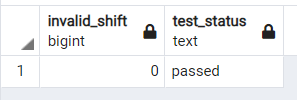
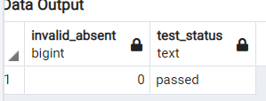

#Timesheet queries

---
###1. Check if there are employees who did not work for the day but have a shift type.
~~~sql
SELECT
    COUNT(*) AS invalid_shift,
    CASE
        WHEN COUNT(*) > 0 THEN 'failed'
        ELSE 'passed'
    END AS test_status
FROM timesheet
WHERE employee_id IN (SELECT employee_id FROM timesheet
					  WHERE hours_worked=0 AND shift_type <>'N/A'
					  GROUP BY employee_id,shift_date)
~~~

###2.  Check if all the departments in timesheet also exist in employee.

~~~sql
SELECT
    COUNT(*) AS invalid_department,
    CASE
        WHEN COUNT(*) > 0 THEN 'failed'
        ELSE 'passed'
    END AS test_status
FROM (
SELECT department_id FROM timesheet
EXCEPT
SELECT DISTINCT e.department_id FROM employee e)result;
~~~

###3. Check if number of absent teammates is correct.

~~~sql
SELECT
    COUNT(*) AS invalid_absent,
    CASE
        WHEN COUNT(*) > 0 THEN 'failed'
        ELSE 'passed'
    END AS test_status
FROM timesheet t
WHERE t.num_teammates_absent IN (SELECT COUNT(*) FROM timesheet_raw WHERE t.department_id=CAST(cost_center AS INT) 
								 AND paycode='ABSENT' GROUP BY department_id,shift_date);
~~~

###4. Check if employees have worked in more than one department in a day
~~~sql
SELECT
    COUNT(*) AS invalid_work_spread,
    CASE
        WHEN COUNT(*) > 0 THEN 'failed'
        ELSE 'passed'
    END AS test_status
FROM timesheet t
WHERE employee_id NOT IN(
	SELECT t.employee_id FROM timesheet 
	GROUP BY t.employee_id,t.department_id,t.shift_date
	HAVING count(employee_id)>1
)
~~~